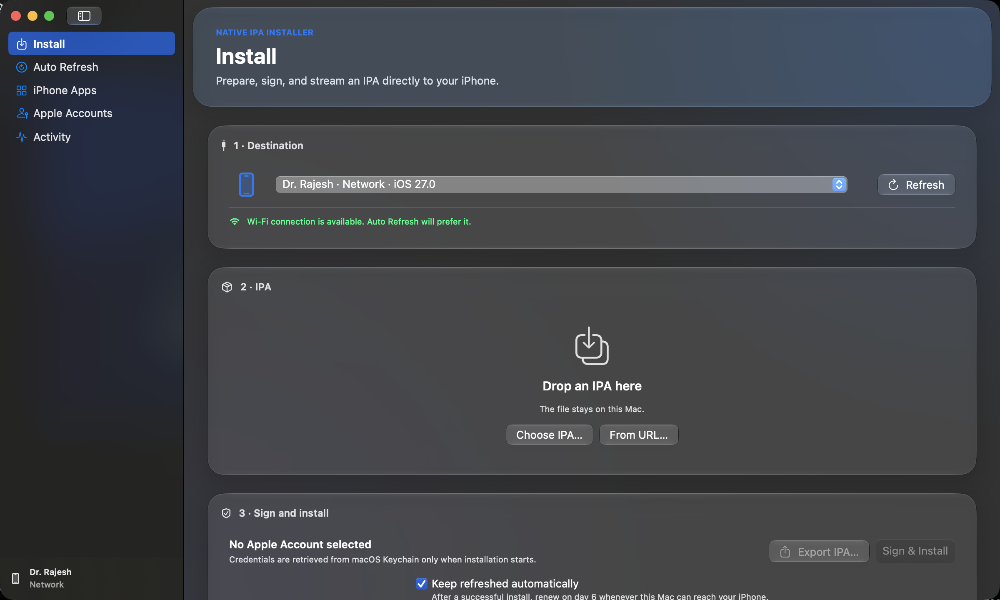
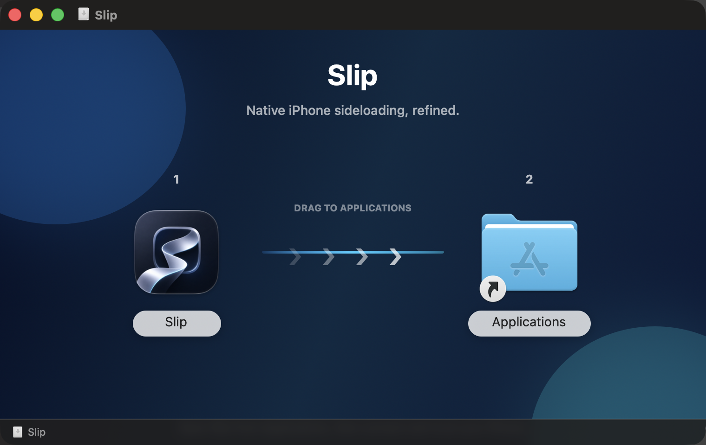

# Slip

Slip is a native Mac home for installing and refreshing IPA files on personal iPhones. Its SwiftUI interface uses the macOS 27 Liquid Glass system, while a focused Rust core handles IPA preparation, Apple signing, and direct device transfer.

Slip is intentionally iPhone-only. It does not target Apple TV, Apple-silicon Macs, jailbroken-device workflows, or permanent-signing claims.





## Highlights

- Native Liquid Glass interface built with SwiftUI and AppKit.
- Drag-and-drop, Finder import, `slip://install?url=…`, and direct HTTPS IPA downloads.
- IPA diagnostics for identity, versions, executable encryption, size, extensions, and free-account App ID cost.
- Change the Home Screen name, bundle ID, icon, minimum iOS version, file-sharing flags, supported-device restriction, and typed top-level Info.plist values.
- Keep or remove each app extension independently, with remove-all as the free-account-friendly default.
- Export a customized IPA without installing it.
- Apple Account sign-in with two-factor prompts and opt-in macOS Keychain storage; credentials never appear in command arguments or logs.
- Fast streamed USB installation with separate preparation, signing, transfer, verification, retry, and recovery feedback.
- Paired local-network discovery, one-click Wi-Fi pairing enablement, and automatic USB fallback.
- Refresh Guard re-signs saved apps about 24 hours before a free seven-day profile expires, provided the Mac and paired iPhone can reach each other.
- Read-only iPhone app inventory, saved refresh recipes, Refresh All, activity history, copyable diagnostics, and privacy redaction.

See the [feature matrix](docs/FEATURE_MATRIX.md) for the exact shipped scope and current iOS 27 limitations.

## Install

1. Download the latest `Slip-*.dmg` from GitHub Releases.
2. Drag Slip to Applications using the installer window.
3. Open Slip, connect and trust the iPhone once over USB, and enable Developer Mode on the iPhone.
4. Add the Apple Account used for personal development. Saving its password in Keychain is optional, but required for unattended Refresh Guard runs.
5. Drop an IPA, review the changes, and select **Sign & Install**.

For network discovery, Finder must first recognize the same paired iPhone and the Mac and iPhone must be on the same normal local network. Personal Hotspot routing often prevents peer discovery.

## The seven-day rule

Apple Personal Team provisioning profiles expire after seven days and stock iOS limits free accounts to three active sideloaded apps. Slip cannot safely or legally remove either server-enforced limit. Refresh Guard performs a normal re-sign and reinstall before expiry; it requires this Mac to be awake, the saved IPA and opt-in Keychain credentials to remain available, and the paired iPhone to be reachable by network or USB.

## Build the native app

Requirements: macOS 15 or newer, Xcode command-line tools, Rust, and an Apple-silicon Mac. The Liquid Glass appearance activates on macOS 26 or newer and falls back to native materials on earlier supported systems.

```sh
./native/build.sh
./native/create-dmg.sh native/build/Slip.app native/dist/Slip-1.0.0.dmg
```

Verification:

```sh
cd src-tauri
cargo fmt --check
cargo check --no-default-features --bin sideloom-core
cargo test --no-default-features --lib
cd ../native
swift build -c debug
```

## Privacy and security

All signing, customization, and device communication happen locally except requests required by Apple developer services and the configured anisette service. Passwords travel to the bundled core over an anonymous stdin pipe and can be stored only through macOS Keychain after explicit consent. Slip does not include analytics or an account server.

Only install or modify apps you are authorized to use. Review [SECURITY.md](SECURITY.md) before reporting a sensitive issue.

## Credits and license

Slip is an independent continuation built on the MIT-licensed foundations of [iLoader](https://github.com/nab138/iloader), [isideload](https://github.com/nab138/isideload), and [idevice](https://github.com/jkcoxson/idevice). It does not contain or redistribute Sideloadly code, assets, branding, or paid-service mechanisms.

The source is covered by [LICENSE](LICENSE). Original iLoader branding terms remain documented in [LICENSE-BRANDING](LICENSE-BRANDING). Slip is not affiliated with Apple, Sideloadly, or the iLoader maintainers.
